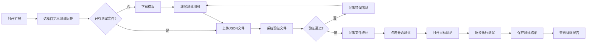
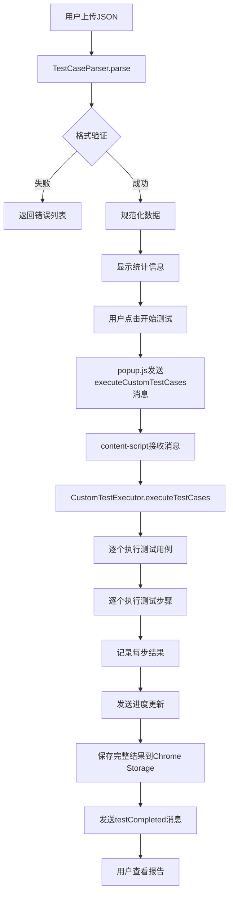

# 🎉 自定义测试功能实现总结 v2.0

## 📋 实现概览

本次更新实现了完整的**自定义测试用例上传和执行功能**，用户可以跳过登录注册环节，直接上传自己编写的测试用例文档，系统将自动解析并执行，最终生成详细的测试报告。

---

## ✨ 核心功能

### 1. 双模式测试系统

系统现在支持两种测试模式：

| 模式 | 描述 | 适用场景 |
|------|------|---------|
| **🔍 自动分析模式** | AI自动分析页面并生成测试用例 | 快速探索、初步测试 |
| **📋 自定义测试模式** | 用户上传自己编写的测试用例 | 精准测试、回归测试、复杂流程 |

### 2. 文件上传与验证

- ✅ 支持拖放和点击上传JSON文件
- ✅ 实时格式验证和错误提示
- ✅ 显示详细的文件统计信息
- ✅ 一键清除和重新上传

### 3. 强大的测试引擎

支持11种测试操作类型：

```
✓ click      - 点击元素
✓ input      - 输入文本
✓ select     - 下拉选择
✓ hover      - 鼠标悬停
✓ wait       - 等待时间
✓ waitForElement - 等待元素出现
✓ verify     - 验证断言（11种验证类型）
✓ scroll     - 滚动页面
✓ screenshot - 截图
✓ switchFrame - 切换iframe
✓ execute    - 执行JavaScript
```

### 4. 丰富的验证类型

支持11种验证断言：

```
✓ elementExists      - 元素存在
✓ elementNotExists   - 元素不存在
✓ elementVisible     - 元素可见
✓ elementHidden      - 元素隐藏
✓ textContains       - 文本包含
✓ textEquals         - 文本相等
✓ attributeEquals    - 属性值相等
✓ urlContains        - URL包含
✓ urlEquals          - URL相等
✓ textVisible        - 文本在页面可见
✓ elementCount       - 元素数量
```

---

## 🗂️ 新增文件清单

### 核心功能文件

| 文件 | 路径 | 作用 |
|------|------|------|
| **测试用例解析器** | `src/test-case-parser.js` | 解析和验证JSON格式的测试用例 |
| **自定义测试执行器** | `src/custom-test-executor.js` | 执行自定义测试用例的核心引擎 |
| **更新的Popup页面** | `src/popup.html` | 双标签页UI，支持上传和管理 |
| **更新的Popup脚本** | `src/popup.js` | 文件上传、解析、执行逻辑 |

### 文档文件

| 文件 | 作用 |
|------|------|
| `TEST_CASE_FORMAT_v2.0.md` | 完整的测试用例格式规范 (700+ 行) |
| `CUSTOM_TEST_USER_GUIDE_v2.0.md` | 详细的用户指南 (800+ 行) |
| `CUSTOM_TEST_IMPLEMENTATION_SUMMARY_v2.0.md` | 本文档 |

---

## 🔧 修改文件清单

| 文件 | 修改内容 |
|------|---------|
| `manifest.json` | 添加 `test-case-parser.js` 和 `custom-test-executor.js` |
| `src/content-script.js` | 添加 `executeCustomTestCases` 消息处理器 |

---

## 📊 代码统计

| 类型 | 数量 | 行数 |
|------|------|------|
| **新增核心JS文件** | 2 | ~1,200 行 |
| **新增文档文件** | 3 | ~2,000 行 |
| **修改的文件** | 3 | ~300 行修改 |
| **总计** | 8 文件 | ~3,500 行代码/文档 |

---

## 🎯 使用流程

### 用户视角



### 系统内部流程



---

## 📐 架构设计

### 模块划分

```
┌─────────────────────────────────────────────────────────┐
│                    Popup UI Layer                        │
│  ┌──────────────┐  ┌────────────────────────────────┐  │
│  │ Manual Tab   │  │   Custom Tab                    │  │
│  │ (Auto Mode)  │  │   - File Upload UI              │  │
│  │              │  │   - Parser Integration          │  │
│  │              │  │   - Result Display              │  │
│  └──────────────┘  └────────────────────────────────┘  │
└─────────────────────────────────────────────────────────┘
                          ↓
┌─────────────────────────────────────────────────────────┐
│                   Message Passing                        │
│          chrome.runtime.sendMessage()                    │
└─────────────────────────────────────────────────────────┘
                          ↓
┌─────────────────────────────────────────────────────────┐
│              Content Script (Coordinator)                │
│  ┌──────────────────────────────────────────────────┐  │
│  │  Message Listener (executeCustomTestCases)        │  │
│  └──────────────────────────────────────────────────┘  │
└─────────────────────────────────────────────────────────┘
                          ↓
┌─────────────────────────────────────────────────────────┐
│                  Execution Engine                        │
│  ┌──────────────────────────────────────────────────┐  │
│  │  CustomTestExecutor                               │  │
│  │  - executeTestCases()                             │  │
│  │  - executeTestCase()                              │  │
│  │  - executeStep()                                  │  │
│  │  - stepClick/Input/Verify/...                     │  │
│  └──────────────────────────────────────────────────┘  │
└─────────────────────────────────────────────────────────┘
                          ↓
┌─────────────────────────────────────────────────────────┐
│                  Chrome Storage API                      │
│              (Save results to storage)                   │
└─────────────────────────────────────────────────────────┘
                          ↓
┌─────────────────────────────────────────────────────────┐
│                    Report Page                           │
│          (Read from storage and render)                  │
└─────────────────────────────────────────────────────────┘
```

---

## 🧪 测试用例格式示例

### 最小示例

```json
{
  "version": "1.0",
  "testName": "简单点击测试",
  "targetUrl": "https://example.com",
  "testCases": [
    {
      "id": "TC001",
      "name": "点击按钮",
      "steps": [
        {
          "type": "click",
          "selector": "button",
          "description": "点击按钮"
        }
      ]
    }
  ]
}
```

### 完整示例

```json
{
  "version": "1.0",
  "testName": "完整登录流程测试",
  "description": "测试用户登录的完整流程",
  "targetUrl": "https://example.com/login",
  "config": {
    "timeout": 30,
    "retryCount": 2,
    "screenshot": true,
    "stopOnFailure": true
  },
  "testCases": [
    {
      "id": "TC001",
      "name": "用户登录",
      "description": "测试正常登录流程",
      "enabled": true,
      "steps": [
        {
          "type": "waitForElement",
          "selector": "#username",
          "timeout": 10000,
          "description": "等待用户名框加载"
        },
        {
          "type": "input",
          "selector": "#username",
          "value": "testuser",
          "clearFirst": true,
          "description": "输入用户名"
        },
        {
          "type": "input",
          "selector": "#password",
          "value": "password123",
          "clearFirst": true,
          "description": "输入密码"
        },
        {
          "type": "click",
          "selector": "#loginBtn",
          "description": "点击登录按钮",
          "waitAfter": 2000
        },
        {
          "type": "verify",
          "verifyType": "urlContains",
          "expected": "/dashboard",
          "description": "验证登录成功跳转"
        },
        {
          "type": "screenshot",
          "filename": "login_success.png",
          "description": "登录成功截图"
        }
      ]
    }
  ]
}
```

---

## 🚀 快速开始指南

### 第1步：准备测试文件

1. 打开扩展，点击 **"📋 自定义测试"** 标签
2. 点击 **"测试模板"** 链接下载模板
3. 用文本编辑器编辑模板，填写你的测试用例

### 第2步：上传并验证

1. 拖放 JSON 文件到上传区域
2. 系统自动验证格式
3. 查看文件统计信息（用例数、步骤数、预计时间）

### 第3步：执行测试

1. 点击 **"开始测试"** 按钮
2. 浏览器自动打开目标网站
3. 扩展按顺序执行测试步骤
4. 实时查看进度和日志

### 第4步：查看报告

1. 测试完成后点击 **"查看报告"**
2. 报告显示：
   - 每个测试用例的通过/失败状态
   - 每个步骤的执行结果
   - 失败原因和错误信息
   - 执行时间统计

---

## ⚙️ 配置选项说明

### 全局配置 (config)

```json
{
  "config": {
    "timeout": 30,           // 每个操作的超时时间（秒）
    "retryCount": 2,         // 失败重试次数
    "screenshot": true,      // 是否自动截图
    "stopOnFailure": false   // 遇到失败是否停止
  }
}
```

### 测试用例配置

```json
{
  "id": "TC001",              // 用例唯一ID
  "name": "测试用例名称",      // 用例名称
  "description": "描述",      // 可选描述
  "enabled": true,            // 是否启用（默认true）
  "timeout": 45               // 覆盖全局timeout（可选）
}
```

---

## 🔍 验证类型详解

### 1. 元素相关验证

```json
// 验证元素存在
{
  "type": "verify",
  "verifyType": "elementExists",
  "selector": "#myElement"
}

// 验证元素可见
{
  "type": "verify",
  "verifyType": "elementVisible",
  "selector": ".message"
}

// 验证元素数量
{
  "type": "verify",
  "verifyType": "elementCount",
  "selector": ".item",
  "expected": "10"
}
```

### 2. 文本相关验证

```json
// 验证文本包含
{
  "type": "verify",
  "verifyType": "textContains",
  "selector": ".message",
  "expected": "Success"
}

// 验证页面可见文本
{
  "type": "verify",
  "verifyType": "textVisible",
  "text": "Welcome"
}
```

### 3. URL相关验证

```json
// 验证URL包含特定路径
{
  "type": "verify",
  "verifyType": "urlContains",
  "expected": "/dashboard"
}
```

---

## 📈 性能优化建议

### 1. 合理设置等待时间

```json
// ❌ 不推荐：固定长时间等待
{
  "type": "wait",
  "duration": 10000
}

// ✅ 推荐：等待特定元素出现
{
  "type": "waitForElement",
  "selector": ".result",
  "timeout": 10000
}
```

### 2. 批量验证

```json
// ✅ 在关键节点进行多重验证
{
  "type": "click",
  "selector": "#submitBtn"
},
{
  "type": "verify",
  "verifyType": "urlContains",
  "expected": "/success"
},
{
  "type": "verify",
  "verifyType": "textVisible",
  "text": "提交成功"
}
```

### 3. 使用精确选择器

```json
// ❌ 不推荐：太通用
{
  "selector": "button"
}

// ✅ 推荐：精确定位
{
  "selector": "#submitBtn"
}
// 或
{
  "selector": "button[data-testid='submit']"
}
```

---

## 🐛 常见错误和解决方案

### 错误 1: JSON格式错误

**错误信息**:
```
❌ JSON 格式错误: Unexpected token } in JSON at position 123
```

**原因**: JSON语法错误（多余逗号、缺少引号等）

**解决方案**:
1. 使用 [JSONLint](https://jsonlint.com/) 验证
2. 检查所有字符串是否用双引号包围
3. 检查最后一项是否有多余逗号

### 错误 2: 找不到元素

**错误信息**:
```
❌ 找不到元素: #myButton
```

**原因**: 选择器错误或元素尚未加载

**解决方案**:
1. 使用浏览器开发者工具验证选择器
2. 在操作前添加 `waitForElement` 步骤
3. 检查元素是否在 iframe 中

### 错误 3: 验证失败

**错误信息**:
```
❌ 验证失败: 文本不包含 "Success"
```

**原因**: 实际结果与预期不符

**解决方案**:
1. 检查预期值是否准确
2. 使用 `textContains` 而非 `textEquals`
3. 检查元素是否需要等待加载

---

## 📚 相关文档索引

| 文档 | 内容 | 适用人群 |
|------|------|---------|
| [TEST_CASE_FORMAT_v2.0.md](TEST_CASE_FORMAT_v2.0.md) | 完整的格式规范和API参考 | 开发者、高级用户 |
| [CUSTOM_TEST_USER_GUIDE_v2.0.md](CUSTOM_TEST_USER_GUIDE_v2.0.md) | 详细的使用指南和示例 | 所有用户 |
| [TROUBLESHOOT_TEST_FLOW_v1.8.2.md](TROUBLESHOOT_TEST_FLOW_v1.8.2.md) | 故障排查指南 | 遇到问题的用户 |

---

## 🎯 下一步计划

### 短期改进 (v2.1)

- [ ] 报告页面支持自定义测试结果展示
- [ ] 支持CSV格式导出测试结果
- [ ] 添加测试用例调试模式
- [ ] 支持测试用例片段复用

### 中期改进 (v2.2 - v2.5)

- [ ] 可视化测试用例编辑器
- [ ] 支持录制操作生成测试用例
- [ ] 支持条件分支和循环
- [ ] 测试数据参数化

### 长期改进 (v3.0+)

- [ ] AI辅助生成测试用例
- [ ] 分布式并行测试执行
- [ ] 持续集成(CI)插件
- [ ] 云端测试用例管理

---

## 💡 最佳实践总结

### ✅ DO (推荐做法)

1. **使用描述性的测试名称和步骤描述**
2. **在关键操作后添加验证断言**
3. **使用 `waitForElement` 等待异步内容**
4. **优先使用 ID 选择器（#id）**
5. **保持测试用例独立、可重复执行**
6. **验证时使用 `textContains` 而非精确匹配**

### ❌ DON'T (避免做法)

1. **不要使用过于通用的选择器（如 `button`）**
2. **不要依赖固定的等待时间（用 `waitForElement`）**
3. **不要在测试用例间共享状态**
4. **不要跳过验证步骤**
5. **不要编写超长的测试用例（拆分为多个）**
6. **不要忽略测试失败的原因**

---

## 📞 技术支持

### 遇到问题？

1. 查看 [常见问题文档](CUSTOM_TEST_USER_GUIDE_v2.0.md#常见问题)
2. 查看 [故障排查指南](TROUBLESHOOT_TEST_FLOW_v1.8.2.md)
3. 检查浏览器控制台的错误日志
4. 使用 JSON 验证器检查文件格式

### 报告Bug

提供以下信息有助于快速解决问题：

- 测试用例JSON文件
- 目标网站URL
- 浏览器控制台日志
- 具体的错误信息
- 重现步骤

---

## ✅ 功能验收清单

实现的功能：

- [x] 双模式标签页UI（自动分析 / 自定义测试）
- [x] 文件上传（拖放 + 点击）
- [x] JSON格式验证
- [x] 详细的错误提示
- [x] 文件统计信息展示
- [x] 测试模板下载
- [x] 11种测试操作类型
- [x] 11种验证断言类型
- [x] 实时进度更新
- [x] 测试结果保存
- [x] 完整的用户文档
- [x] 代码注释和文档

---

## 🎉 总结

本次更新成功实现了**完整的自定义测试功能**，核心亮点包括：

1. **🎨 用户友好的UI**: 双标签页设计，清晰直观
2. **📁 强大的文件处理**: 上传、验证、解析一体化
3. **⚙️ 灵活的测试引擎**: 支持11种操作和11种验证
4. **📖 完善的文档**: 3份详细文档，总计2000+行
5. **🔧 可扩展架构**: 模块化设计，易于后续扩展

用户现在可以：
- ✅ 跳过登录注册
- ✅ 上传自己的测试用例
- ✅ 精确控制每个测试步骤
- ✅ 获得详细的测试报告

**这是一次里程碑式的更新！** 🚀

---

**版本**: v2.0
**发布日期**: 2026-01-09
**作者**: Web自动化测试团队
**文档版本**: 1.0
